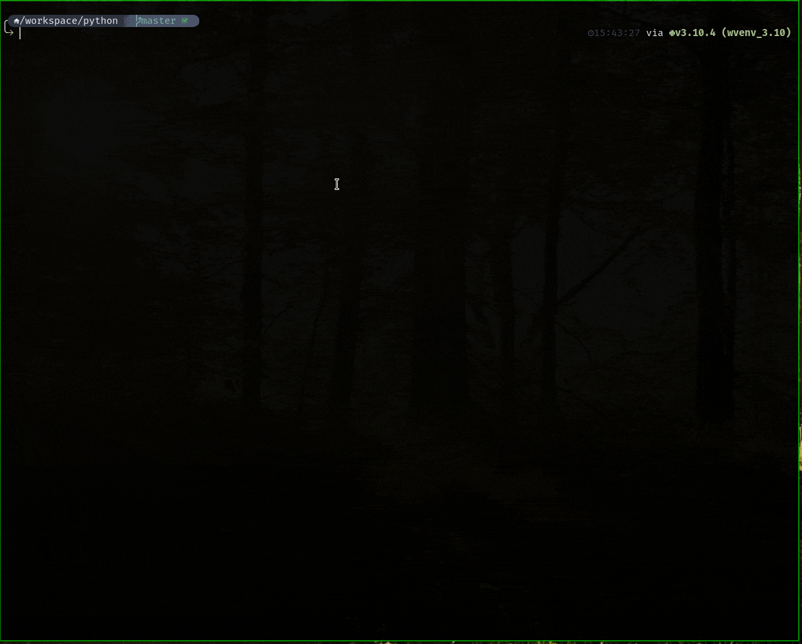
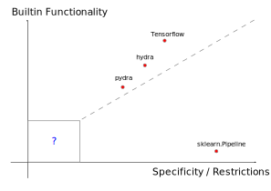

# xileh

A lightweight, composable pipeline abstraction built around a hierarchical
data container.



## Overview

`xileh` abstracts complex processing pipelines, motivated by `sklearn.Pipeline`
but with data capacities going beyond a feature matrix `X` and target `y`. It
is built from two components:

- **`xData`** — a hierarchical container holding *data*, a *header*
  (description / control flags), and *meta* information. It can nest other
  `xData` objects to pass multiple data entities through a pipeline.
- **`xPipeline`** — an ordered set of plain Python functions, each taking and
  returning an `xData` object.


### Why build something new?

Placing libraries on two axes — *built-in functionality* and
*specificity / restrictions* — `xileh` deliberately aims for minimal built-in
functionality and maximal freedom of customization.



`sklearn.Pipeline` is great for ML pipelines but specific about data shape and
the `fit`/`transform` contract. Config-driven tools like `hydra` provide a
single source of truth but impose a format that can hinder rapid prototyping.
`xileh` instead:

- imposes as few restrictions on your workflow as possible (arbitrary data
  objects and plain Python functions),
- integrates easily with a function-based workflow during development,
- provides a single source of truth for the processing,
- enables reuse of whole pipelines by strongly motivating composition.

## Installation

```bash
pip install xileh
```

Or from source:

```bash
git clone git@github.com:bsdlab/xileh.git
cd xileh
pip install -e .
```

`xileh` targets Python 3.11+.

## Quick example

```python
from xileh import xData, xPipeline


def add_ones(pdata, name="ones", size=3):
    pdata.add([1] * size, name=name)
    return pdata


pl = xPipeline("demo")
pl.add_steps(("add_ones", add_ones))

root = xData([], name="root")
pl.eval(root)
```

> The container was renamed from `xPData` to `xData`; `xPData` remains
> available as a backwards-compatible alias.

## Documentation

Full documentation, including a quick-start guide, worked examples, and the API
reference, is available at
**[bsdlab.github.io/xileh](https://bsdlab.github.io/xileh/)**.

## License

[MIT](LICENSE)
