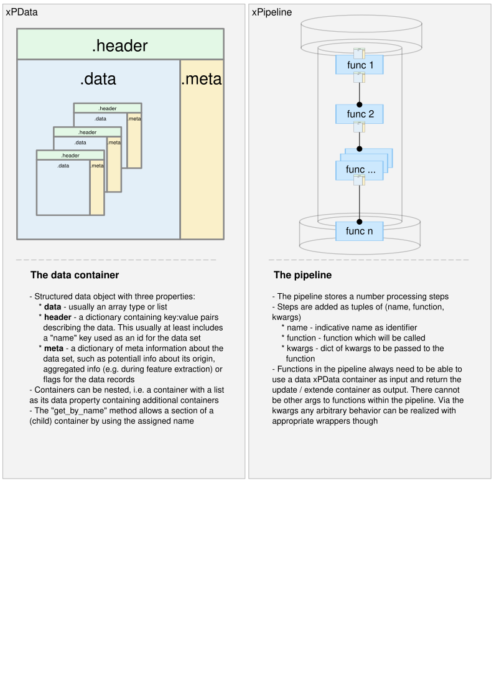

# Xileh
Module for optimizing pipeline with genetic algorithms


# General structure
The idea of this is to abstract complex processing pipelines based of the `scipy.pipeline` setup,
but with extended data capacities going beyond a feature matrix `X` and potential labels / regression
targets `y`.
For this end, the abstraction is based of two main components, the `pipeline` and the `pipelinedata`.
The pipeline consists of functions acting upon the pipeline data. Functions are added to the pipeline
during initialization and the pipeline is later evaluated given a `pipelinedata` entity.

## Schematic


## Why build something new?
As with every project, the first question should be, if there is anything already available which serves the purpose...
If looking at libraries in two main dimensions, i.e. `builting functionality` and `specificity / restrictions`, we would end up with the following graph IMHO.


Usually one would not want to end up in the lower left quadrant of such a split, but here `xileh` aims to be exactly there. I.e. provide only a very limited scope of functionality built-in, but allow for maximal freedom of customization by being as general as possible.

Take for example the `sklearn.Pipeline` which `xileh` is motivated on. It is great to build, store and evalute all kind of machine learning piplines, but it is very specific in which type (shape) of data it can process and how it its doing it (`fit` / `transform`). Of course `sklearn` as a whole has a huge bunch of functionaly implemented but then would need to have different processing steps glued together by custom code, no longer allowing for this single object describing the full pipeline.

Other libraries like `hydra` are based of (a single) config file(s) which provide a good overview and single point of truth for the processing, but hence this again requires a quite specific format and might thus hinder rapid prototyping.

So xileh deliberatly wants to:
* impose as little restrictions to you workflow as possible (dealing with arbitrary data objects and python functions)
* integrate easily with a function's based workflow during development
* provide a single source of truth for the processing
* enable reuseabilty of whole pipelines by strongly motivating composition


# Getting Started

## Installation
Clone the `master` branch, or for compatebility of storing basic `mne` data entities, use the `mne` branch
```bash
git clone git@github.com:bsdlab/xileh.git
```

From within the folder, install to your pip repo or just link, depeding on your liking.
```bash
pip install .
# or 
pip install develop
```

## Pipelinedata
The `xileh.core.pipelinedata.xPData` implements the pipelinedata container, which contains of three elements:
1.  A data entity, usually an array or array-like. Possible also a list of other `xPData` entities.
2.  Header information as a dictionary containing information about the whole data set used to describe the data in 1.
3.  Meta information as a dictionary containing meta data about 1., such as configuration info for the processing, aggregated measure, or per record meta data. Note that if a dictionary value has a shape property, it is assumed that it should contain a per record (i.e. 1 meta elements per value) info and is thus checked for its length upon initialization. So to provide an array which does not match the length of 1. you have to pack it into an object without shape property first.

All 1.-3. are potentially extended by processing steps within the pipeline. However, processing should in general not change any entities provided during initialization, but create new copies. There might be reasons however, where a change is required (e.g. memory constraint). Overwriting is thus not restricted.

### Initializing a container

```python
from xileh import xPData

# single data container -> nothing can be added
pdata = xPData("somedata", name='mycontainer')

# a container which can be dynamically extended, if the data arg is of type list
pdata = xPData([], name='mycontainer')

# with header or meta data
pdata = xPData([], name='cont1',
    header={'description': 'some useful container'}
)

# nested initialization
pdata = xPData(
    [
        xPData([1, 2, 3, 4], name='array_1')
    ],
    name='outer_container_1'
)
  

#### Get and set
`pytho 
# those getters are e 
pdata.get_by_name('array_1') == pdata['array_1'] == pdata.array_1 

# setting can be done accordingly
pdata.get_by_name('array_1').data = np.ones(3)
pdata['array_1'].data = np.ones(3)
pdata.array_1.data = np.ones(3)

# or overwriting whole containers
td = xPData(np.ones(3), name='new_array')
pdata.get_by_name('array_1') = td
pdata['array_1'] = td
pdata.array_1 = td
```

### Add 
```python
# basic way of adding a new container via get by name. Without the
# create_if_missing=True, a None value would be returned
newc = pdata.get_by_name('newcont', create_if_missing=True)
newc.data = np.ones(123)
newc.header['description'] = 'A few ones for important reasons'

# or more concise
pdata.add(np.ones, 'newcont', header={'description': 'A few ones for important reasons'})
```

### Delete 
```python
pdata.delete_by_name('newcont')
```

#### Some Utility
Simply calling the container prints some overview info reflecting the hierarchy of stored data and indicating <name>: <type> if it is a *leaf-container*.

```python
In [10]: pdata = xPData(
    ...:     [
    ...:         xPData([1, 2, 3, 4], name='array_1'),
    ...:         xPData('string', name='string_1'), 
    ...:         xPData(pd.DataFrame(), name='df1')
    ...:     ],
    ...:     name='outer_container_1'
    ...: )

In [11]: pdata
Out[11]:
xPData object at 0x7f8b023b3880 - with size 32
outer_container_1:
|   array_1:    list
|   string_1:   <class 'str'>
|   df1:        <class 'pandas.core.frame.DataFrame'>
'--------------------
```

Only container names:
```python
In [12]: pdata.get_container_names()
Out[12]: ['outer_container_1', 'array_1', 'string_1', 'df1']
```
Dict of containers and types:
```python
In [15]: pdata.get_containers()
Out[15]:
{'outer_container_1': [{'array_1': []},
  {'string_1': str},
  {'df1': pandas.core.frame.DataFrame}]}

In [14]: pdata.gc()
Out[14]:
{'outer_container_1': [{'array_1': []},
  {'string_1': str},
  {'df1': pandas.core.frame.DataFrame}]}
```

### Save and load
```python
In [16]: pdata.save('./test_container')

In [17]: from xileh.core.pipelinedata import from_container

In [18]: newc = from_container('./test_container/')

In [19]: newc
Out[19]:
xPData object at 0x7f8b024e71c0 - with size 32
outer_container_1:
|   array_1:    list
|   string_1:   <class 'str'>
|   df1:        <class 'pandas.core.frame.DataFrame'>
'--------------------
```


## Pipelines
Pipelines are concatenations of functions operating on `xPData` objects. Therefore, all pipeline functions shoud follow the pattern outlined below
### Functions signature

```python
def add_data_entity(pdata, name='myname', **kwargs):
    """ 
    Add a simply data entity to the container 

    NOTE: A valid function for processing within a pipeline will have only
    one arg, which is the xPData objects that is processed, but can have
    any number of kwargs, which will also be logged with the pipeline object
    """
    pdata.add([1, 2, 3] * size, name)

    # Note, every function used in a pipeline needs to return the pdata object
    # --> this is to make explicit, that the function modifies the pdata object
    return pdata
```

### Initialization
```python
pl = xPipeline('test_pipeline', log_eval=False)
pl.add_steps(
    ('add_to_data', add_data_entity),
    ('add_to_data_2', add_data_entity, {'name': 'another_test'}),
)
```

### Representation
Calling the pipeline object will list on the steps 
```python
In [5]: pl
Out[5]:
<xileh.core.pipeline.xPipeline object at 0x7f877d135cf0>
Pipeline name: test_pipeline
Steps:
        -> 'add_to_data'
        -> 'add_to_data_2'

```
Calling for the `.steps` attribute will also show the internal list of tuples (`<name>`, `<function>`, `<kwargs_dict>`)
```python
In [12]: pl.steps
Out[12]:
[('add_to_data',
  <function __main__.add_data_entity(pdata, name='myname', **kwargs)>,
  {}),
 ('add_to_data_2',
  <function __main__.add_data_entity(pdata, name='myname', **kwargs)>,
  {'name': 'another_test'})]

```

It is also possible to look just at a specific step by looking for its name
```python
In [14]: pl.get_step('add_to_data_2')
Out[14]:
(('add_to_data_2',
  <function __main__.add_data_entity(pdata, name='myname', **kwargs)>,
  {'name': 'another_test'}),
 1)
```


### Evaluating the pipeline
Pipelines use the `.eval()` method to process data
```python
pdata = xPData([], name='outercontainer')
pl.eval(pdata)          # will process the steps 'add_to_data' and 'add_to_data_2'
```

### Reuse in other modules

If pipelines are defined on a global scope in a script or module, you can simple import it:
```python
from xileh import xPData, xPipeline
from my_module.my_script import my_pl as pre_pl

# ================================= Functions =================================
def print_foo(pdata):
    for name in pdata.get_container_names():
        print(f"{name} - {pdata[name].data}")

# ================================= Pipeline ==================================
pl = xPipeline('test_pipeline', log_eval=False)

pl.add_steps(
    ('print_before', print_foo),
    *pre_pl.steps,
    ('print_after', print_foo)
    )
```

### Modification
Steps can either be replaced completely 
```python
In [17]: def foo(pdata, k='abc'):
    ...:     return pdata
    ...:

In [18]: pl.replace_step('add_to_data', ('new_step', foo))

In [19]: pl
Out[19]:
<xileh.core.pipeline.xPipeline object at 0x7f877d135cf0>
Pipeline name: test_pipeline
Steps:
        -> 'new_step'
        -> 'add_to_data_2'
        -> 'test_step'
```

or their kwargs can be modified
```python
In [20]: pl.add_steps(('test_step', foo))

In [21]: pl.set_step_kwargs('test_step', k='cde')

In [22]: pl.steps
Out[22]:
[('add_to_data',
  <function __main__.add_data_entity(pdata, name='myname', **kwargs)>,
  {}),
 ('add_to_data_2',
  <function __main__.add_data_entity(pdata, name='myname', **kwargs)>,
  {'name': 'another_test'}),
 ('test_step', <function __main__.foo(pdata, k='abc')>, {'k': 'cde'})]

```

and of course they can be deleted
```python
In [23]: pl.remove_step('new_step')

In [24]: pl
Out[24]:
<xileh.core.pipeline.xPipeline object at 0x7f877d135cf0>
Pipeline name: test_pipeline
Steps:
        -> 'add_to_data_2'
        -> 'test_step'
In [25]: pl.remove_steps(['add_to_data_2', 'test_step'])

In [26]: pl
Out[26]:
<xileh.core.pipeline.xPipeline object at 0x7f877d135cf0>
Pipeline name: test_pipeline
Steps:
        ->
```

#### Early Stopping
Stopping an evaluation early can be achieved by setting `early_stop` parameter
within the `pdata.header`. This would be done in any pipeline function
which you would want to trigger an early stop (e.g. you load data and nothing
is found -> skip all processing).

```python
pdata.header['early_stop'] = True
```

## Working with xileh
A general example of how a script could be structured is provided in this template
#### Template


# TODOS
[ ] move `.nemo_eval()` to a separate branch
